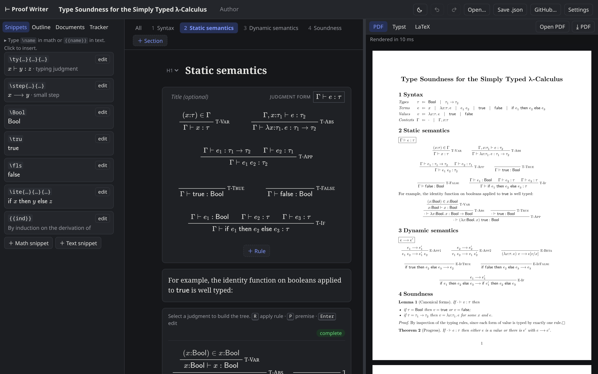
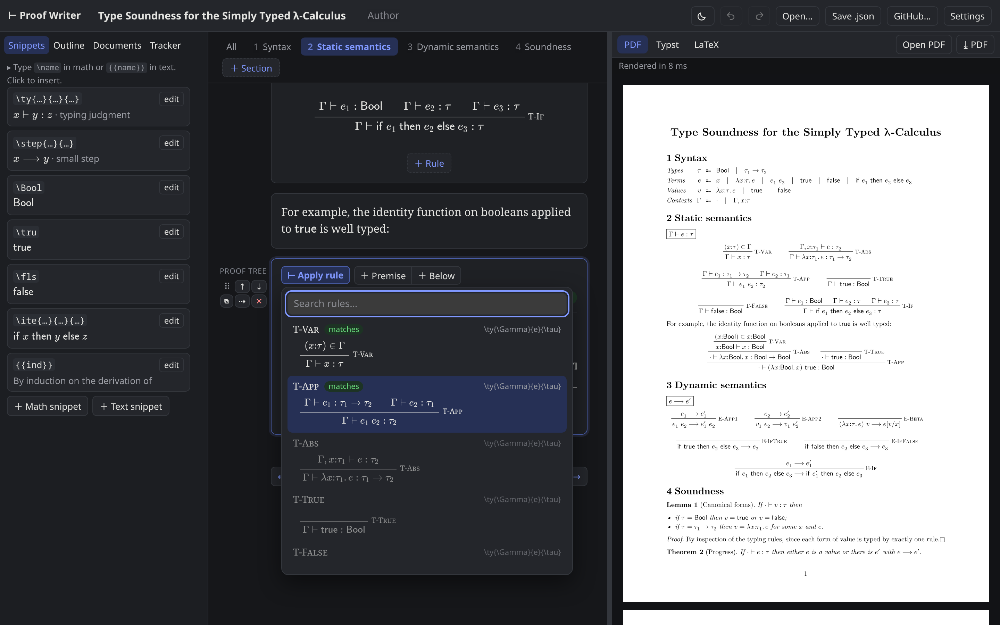
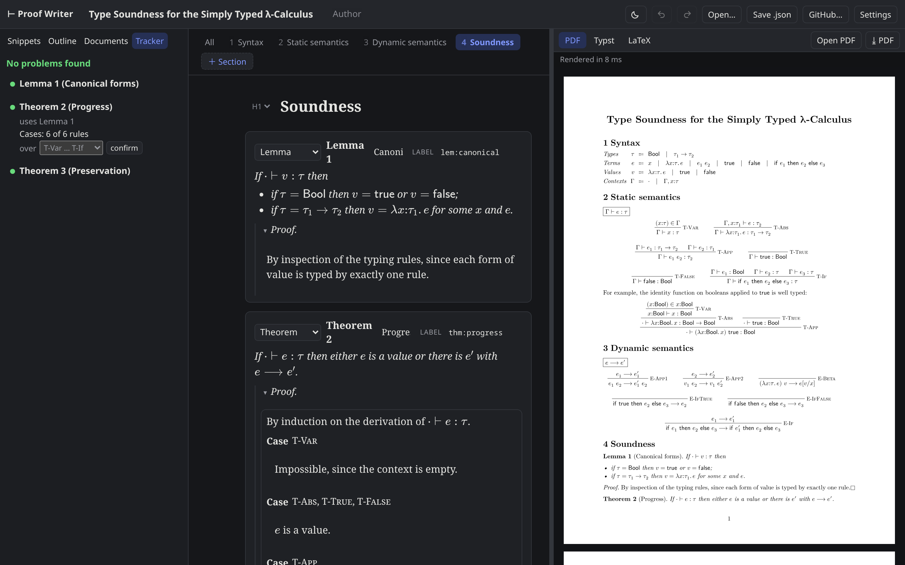

# Proof Writer

An editor for type systems and their metatheory: grammars, inference rules,
proof trees, lemmas and soundness proofs in one document, with a live PDF
preview and export to **Typst** and **LaTeX**.

**[Open the app](https://singularitty.github.io/proof-writer/)** · [Guide](docs/guide.md)

It runs entirely in the browser. There is nothing to install and no account,
and it opens with a worked example (type soundness for the simply typed
λ-calculus) that you can edit straight away.

[](https://singularitty.github.io/proof-writer/)

## What it does

* **Rules and grammars as structure, not markup.** Fill in premises, a
  conclusion and a name; the layout of the rule is done for you. Grammars are
  BNF tables.
* **Proof trees built by applying rules.** Select a judgment, press `R`, and
  pick from the rules whose conclusion matches it. The premises are filled in,
  and metavariables the conclusion doesn't determine become unknowns that later
  steps solve.
* **A live PDF preview.** The Typst compiler runs in the page as WebAssembly, so
  the preview updates as you type and works offline once loaded. Click anything
  in the preview to jump to the block that produced it.
* **Typst and LaTeX from the same document.** Write math once, in LaTeX syntax.
  The Typst export is self-contained; the LaTeX export uses `amsthm` and
  `mathpartir` and compiles with `pdflatex`.
* **Checks on the proof's structure.** The Tracker lists dangling references,
  lemmas nothing uses, circular dependencies, case analyses that miss a rule,
  and proof trees with open goals or steps that no longer match their rule.
* **Macros and references.** Define `\ty{\Gamma}{e}{\tau}` once and use it
  everywhere; `[[lem:canonical]]` becomes "Lemma 1" and `[[T-App]]` a rule name.
* **Your files stay yours.** Documents are saved in the browser and as plain
  `.json` files, and can be opened from and committed to a GitHub repository.
  Existing Typst files using curryst can be imported.

| Applying a rule in a proof tree | Checking a proof |
| --- | --- |
|  |  |

The [guide](docs/guide.md) covers every block type, the proof tree keys,
snippets, the GitHub integration, Typst import and the full list of checks.

## Desktop app

The same app runs as a desktop app for Linux, macOS and Windows, where
documents are ordinary files: Open and Save use native dialogs, and a document
that changes on disk is reloaded.

```sh
npm install
npm run electron:dev     # build and launch
npm run electron:build   # installers for the current OS, in release/
```

`electron:build` makes an AppImage and `.deb` on Linux, a `.dmg` on macOS and
an installer `.exe` on Windows. The **Desktop builds** workflow in the Actions
tab builds all three, and pushing a `v*` tag attaches them to a GitHub release.
The macOS build is unsigned, so the first launch needs right-click → Open.

## Running it locally

```sh
npm install
npm run dev        # http://localhost:5173
```

`npm run build` produces a static site in `dist/` that can be hosted anywhere.
It has to be served over HTTP, not opened as a file. Pushing to `main` deploys
it to GitHub Pages via `.github/workflows/pages.yml`.

## Development

```sh
npm test           # unit tests; also compiles the exports if `pdflatex` and the
                   # Python `typst` package are installed
npx tsc --noEmit   # type check
```

Source layout:

* `src/model` — document types, sample document, proof tree operations
* `src/latex` — LaTeX math tokenizer/parser, LaTeX→Typst converter, macro
  expansion, rule matching and unification
* `src/export` — prose format, Typst and LaTeX exporters
* `src/check` — document checks, their arrangement for the Tracker tab, and the
  command-line entry
* `mod/proof-tracker` — the Claude Code plugin
* `src/components` — the editor UI (React)
* `src/preview` — Typst compiler worker and SVG preview. The preview is updated
  in place: the compiler sends only what an edit changed, and the drawing is
  patched instead of redrawn
* `electron` — desktop shell: window, menu, native file dialogs (`main.cjs`),
  and the `window.desktop` bridge (`preload.cjs`)
* `public/fonts` — New Computer Modern (text and math) and DejaVu Sans Mono, from
  [typst-assets](https://github.com/typst/typst-assets)

## Contributing

Bug reports and suggestions are welcome in the
[issue tracker](https://github.com/Singularitty/proof-writer/issues). If a
document renders or exports wrongly, attaching its `.json` file helps most.

## License

[MIT](LICENSE). The bundled fonts are under their own licenses; see
[typst-assets](https://github.com/typst/typst-assets).
